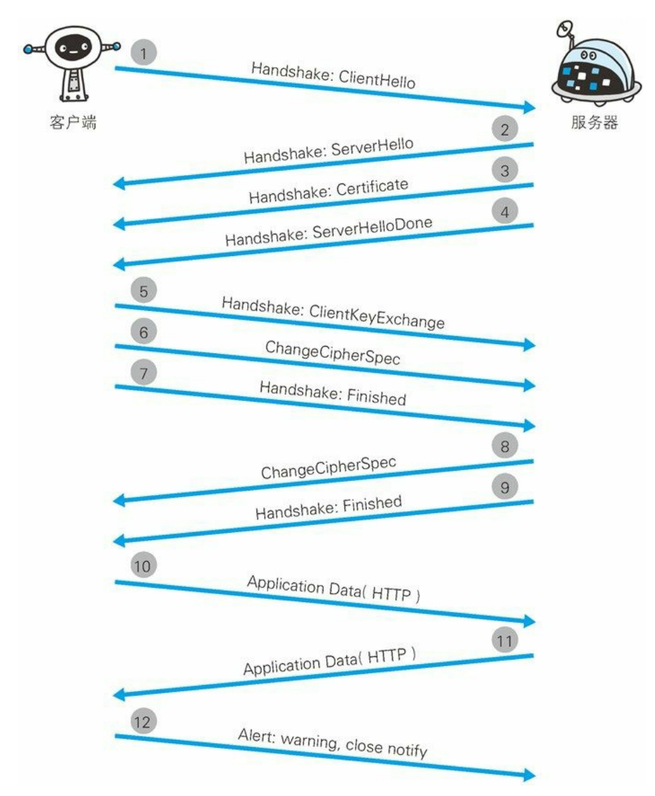

### HTTP 与 HTTPS 有哪些区别？
HTTP + 加密 + 认证 + 完整性保护 = HTTPS
1. HTTPS  协议需要到 CA （ Certificate Authority ，证书颁发机构）申请证书，一般免费证书较少，因而需要一定费用。
2. HTTP 是超文本传输协议，信息是明文传输，HTTPS 则是具有安全性的 SSL 加密传输协议。
3. HTTP 和 HTTPS 使用的是完全不同的连接方式，用的端口也不一样，前者是 80 ，后者是 443 。
4. HTTP 的连接很简单，是无状态的。HTTPS 协议是由 SSL+HTTP 协议构建的可进行加密传输、身份认证的网络协议，比 HTTP 协议安全。(无状态的意思是其数据包的发送、传输和接收都是相互独立的。无连接的意思是指通信双方都不长久的维持对方的任何信息。)

### 加密
- 共享密钥加密（对称密钥加密）：加密和解密用同一个密钥。
- 公开密钥加密：使用一对非对称密钥（私钥、公钥），发送方使用对方的公钥加密，对方收到加密信息，用自己的私钥进行解密。

### HTTPS 加密机制
HTTPS 采用混合加密机制，在交换密钥环节使用公开密钥加密方式（非对称密钥加密），之后的建立通信交换报文阶段使用共享密钥加密方式（对称密钥加密）。

### HTTPS 通信步骤

步骤 1： 客户端通过发送 Client Hello 报文开始 SSL 通信。报文中包含客户端支持的 SSL 的指定版本、加密组件（Cipher Suite）列表（所使用的加密算法及密钥长度等）。

步骤 2： 服务器可进行 SSL 通信时，会以 Server Hello 报文作为应答。和客户端一样，在报文中包含 SSL 版本以及加密组件。服务器的加密组件内容是从接收到的客户端加密组件内筛选出来的。

步骤 3： 之后服务器发送 Certificate 报文。报文中包含公开密钥证书。

步骤 4： 最后服务器发送 Server Hello Done 报文通知客户端，最初阶段的 SSL 握手协商部分结束。

步骤 5： SSL 第一次握手结束之后，客户端以 Client Key Exchange 报文作为回应。报文中包含通信加密中使用的一种被称为 Pre-mastersecret 的随机密码串。该报文已用步骤 3 中的公开密钥进行加密。

步骤 6： 接着客户端继续发送 Change Cipher Spec 报文。该报文会提示服务器，在此报文之后的通信会采用 Pre-master secret 密钥加密。

步骤 7： 客户端发送 Finished 报文。该报文包含连接至今全部报文的整体校验值。这次握手协商是否能够成功，要以服务器是否能够正确解密该报文作为判定标准。

步骤 8： 服务器同样发送 Change Cipher Spec 报文。

步骤 9： 服务器同样发送 Finished 报文。

步骤 10： 服务器和客户端的 Finished 报文交换完毕之后，SSL 连接就算建立完成。当然通信会受到 SSL 的保护。从此处开始进行应用层协议的通信，即发送 HTTP 请求。

步骤 11： 应用层协议通信，即发送 HTTP 响应。

步骤 12： 最后由客户端断开连接。断开连接时，发送 close_notify 报文。上图做了一些省略，这步之后再发送 TCP FIN 报文来关闭与 TCP的通信。

#### 认证过程
- ① 服务器把自己的公开密钥登录至数字证书认证机构。
- ② 数字证书认证机构用自己的私有密钥对服务器的公开密钥做数字签名，并颁发数字证书。
- ③ 客户端拿到服务器的公钥证书后，使用数字证书认证机构的公开密钥，向数字证书认证机构进行验证，以确认服务器公开密钥的真实性。
- ④ 客户端使用服务器的公开密钥对报文加密后发送。
- ⑤ 服务器用私有密钥对报文进行解密。
