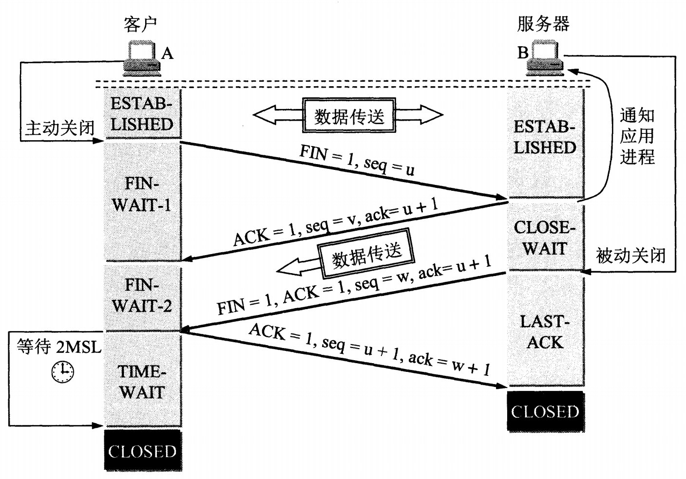

### TCP 的连接释放（四次挥手）

数据传输结束后，通信的双方都可释放连接。
客户端和服务端都处于 **ESTABLISHED** 状态。

客户端的应用进程先向其 TCP 发出连接释放报文段，并停止再发送数据，主动关闭 TCP 连接。
客户端把连接释放报文段首部的终止控制位 FIN 置 1 ，
其序号 seq=u ，它等于前面已传送过的数据的最后一个字节的序号加 1 。
这时客户端进入 **FIN-WAIT-1** （终止等待-1）状态，等待服务端的确认。
 TCP 规定， FIN 报文段，即使不携带数据，也**消耗掉一个序列号**。

服务端收到连接释放报文段后即发出确认 ACK=1 ，确认号是 ack=u+1 ，
这个报文段自己的序号是 v ，等于服务端前面已传送过的数据的最后一个字节的序号加 1 。
然后服务端就进入了 **CLOSE-WAIT** （关闭等待）状态。
 TCP 服务器进程这时应通知高层应用进程，因而从客户端到服务端这个方向的连接就释放了，
 这时的 TCP 连接处于**半关闭状态** (half-close) 状态，即客户端已经没有数据要发送了，
 但服务端若发送数据，客户端仍要接收。也就是说从服务端到客户端这个方向的连接并未关闭，
 这个状态可能会持续一段时间。
 客户端收到来自服务端的确认后，就进入到 **FIN-WAIT-2** （终止等待-2）状态，
 等待服务端发出的连接释放报文段。

 若服务端已经没有要向客户端发送的数据，其应用进程就通知TCP释放连接。
 这时服务端发出的连接释放报文段必须使 ACK=1， FIN=1 。
 现假定服务端发送数据的序号为 w （在半关闭状态下服务端可能向客户端又发送了一些数据）。
 服务端还必须重复上次已发送过的确认号 ack=u+1 。
 这时服务端就进入了 **LAST-ACK** （最后确认）状态，等待客户端的确认。

客户端在收到服务端的释放报文段后，必须对此放出确认，在确认报文段中 ACK 置 1  ，
确认号 ack=w+1 ，自己的序号 seq=u+1 （根据 TCP 标准，前面发送过的 FIN 报文段要消耗掉一个序号）。
然后进入到 **TIME-WAIT** （时间等待）状态。**这时 TCP 连接还没有释放掉**，必须经过时间等待计时器 (TIME-WAIT timer)
设置的时间 **2MSL** （最长报文段寿命， Maximum Segment Lifetime） 后，客户端才进入 **CLOSED** 状态

### 为什么客户端在 TIME-WAIT 状态必须等待 2MSL 的时间？
① **为了保证客户端发送的最后一个 ACK 报文段能到达服务端。**
这个 ACK 报文段有可能丢失，因而使处在 LAST-ACK 中的服务端收不到对已发送的 FIN+ACK 报文段的确认。
服务端会超时重传这个 FIN+ACK 报文段，接着客户端重传一次确认，重新启动 2MSL 计时器。
最后客户端和服务端都正常进入到 CLOSED 状态。
如果客户端在 TIME-WAIT 阶段不等待一段时间，而是在发送完 ACK 报文段后立即释放连接，
那么就无法收到服务端重传的 FIN+ACK 报文段，因而也不会再发送一次确认报文段，
这样服务端就无法按照正常步骤进入到 CLOSED 状态。

② **防止“已失效的连接请求报文段”出现在本连接中。**
客户端在发送完最后一个 ACK 报文段后，再经过 2MSL 时间，就可以使本连接持续的时间内
所产生的所有报文段都从网络中消失。这样就可以使下一个新的连接中不会出现旧的连接请求报文段。
服务器只要收到了来自客户端的确认，就进入 CLOSED 状态。

### 如果已经建立了连接，但是客户端突然出现故障了怎么办？
TCP还设有一个**保活计时器**，
显然，客户端如果出现故障，服务器不能一直等下去，白白浪费资源。
服务器每收到一次客户端的请求后都会重新复位这个计时器，
时间通常是设置为2小时，若两小时还没有收到客户端的任何数据，
服务器就会发送一个探测报文段，以后每隔75秒钟发送一次。
若一连发送10个探测报文仍然没反应，服务器就认为客户端出了故障，接着就关闭连接。
