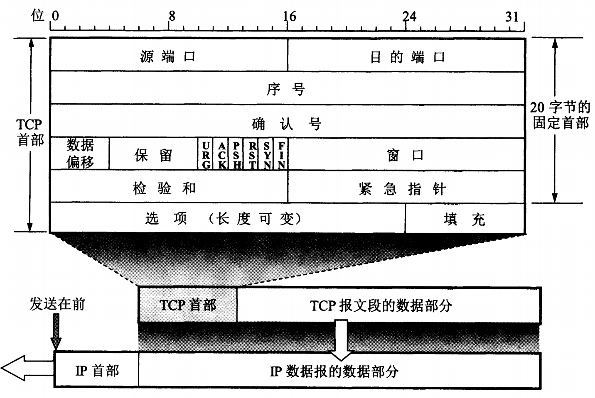

### TCP报文首部
 TCP 报文段首部的前 20 个字节是固定的， 后面有 4n 字节是根据需要而增加的选项。
  TCP 首部的最小长度是 20 字节。

 

1. 源端口、目的端口：各占 2 字节。
2. 序号 seq ：占 4 字节。
3. 确认号 ack ：占 4字节。
4. 数据偏移：占 4 位。
5. 保留：占 6 位，保留为今后使用，目前应置为 0 。
6. 下面有 6 个控制位：
  - 紧急 URG : 当 URG=1 时，紧急指针有效。
  - **确认 ACK** : 仅当 ACK=1 时，确认号字段才有效。
  - 推送 PSH : 当两个应用进程进行交互式通信时，有时在一端的应用进程希望在键入一个命令后能够立即就收到对方的响应。接收方 TCP 收到 PSH=1 的报文段，就尽快地交付接收应用进程，而不再等到整个缓存都填满了后再向上交付。
  - 复位 RST : 当 RST=1 时，表明 TCP 连接中出现严重差错，必须释放连接，然后再重新建立连接。 RST 置 1 还用来拒绝一个非法的报文段或拒绝打开一个连接。
  - **同步 SYN** :在连接建立时用来同步序号。当 SYN=1 而 ACK=0 时，表明这是一个连接请求报文段。对方若同意建立连接，则应在响应的报文段中使 SYN=1 且 ACK=1 。因此， SYN 置为 1 就表明这是一个连接请求或连接接受报文。
  - **终止 FIN** : 用来释放一个连接。当 FIN=1 时，表明此报文段发送方的数据已发送完毕，并要求释放连接。
7. 窗口：占 2 字节。窗口指的是发送本报文段的一方的接收窗口（而不是自己的发送窗口）。窗口值告诉对方：从本报文段首部中的确认号算起，接收方目前允许对方发送的数据量（以字节为单位）。因为接收方的数据缓存空间有限。
8. 检验和：占 2 字节。检验和字段检验的范围包括首部和数据两部分。和 UDP 一样，在计算检验和时，要在 TCP 报文段的前面加上 12 字节的伪首部。
9. 紧急指针：占 2 字节。紧急指针仅在 URG=1 时才有意义，它指出本报文字段的紧急数据的字节数（紧急数据结束后就是普通数据）。紧急指针指出了紧急数据的末尾在报文段中的位置。即使窗口为零时也可发送紧急数据。
10. 选项：长度可变，最长可达 40 字节。当没有使用选项时， TCP 首部长度为 20 字节。
