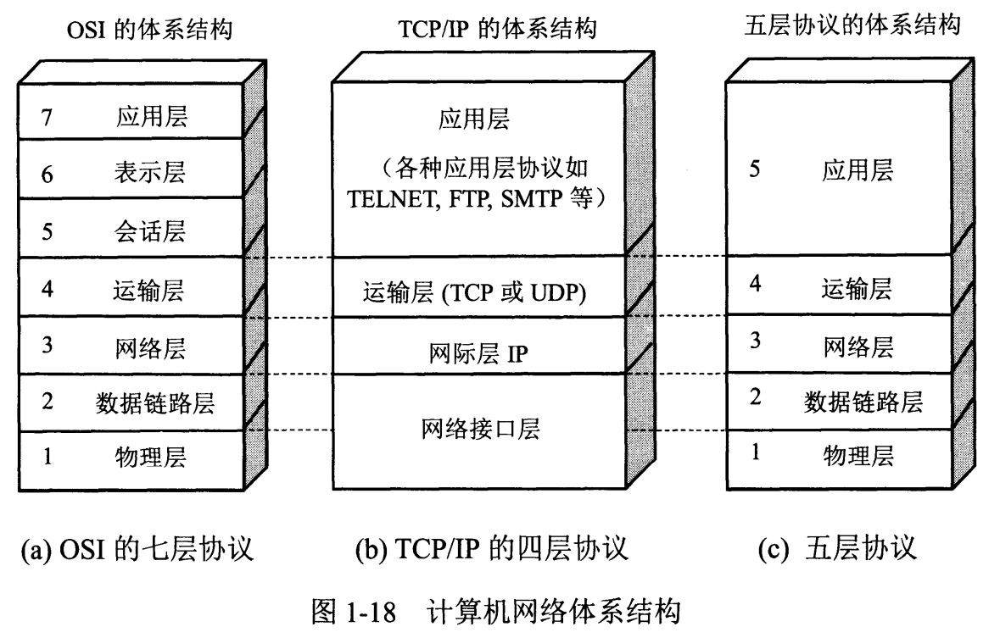

### 计算机网络体系结构

#### OSI七层模型
1. 物理层：利用传输介质为数据链路层提供物理连接，负责处理数据传输率并监控数据出错率，实现比特流的透明传输。

2. 数据链路层：在物理层提供的服务基础上，数据链路层在数据实体之间建立数据链路连接，传输以帧为单位的数据包，在采用差错控制和流量控制方法，是有差错的物理链路便成无差错的数据链路。

3. 网络层：为分组通过网络选择合适的路径，实现路由选择和分组转发拥塞控制等。

4. 传输层：向用户提供的端到端服务，处理数据报错误，数据包次序，向高层屏蔽了下层数据通讯细节。

5. 会话层：维护两个计算机之间的传输链接，保证点到点传输不中断，以及管理数据交换等。

6. 表示层：用于处理两个通信系统中交换信息的表示方式，主要有数据格式交换，数据加密数据解秘，数据压缩等。

7. 应用层：为应用软件提供服务。

#### 各层有哪些协议
| OSI七层模型 | 功能 | 对应的网络协议 |
| :-----------: | :---- | :-------------- |
|  应用层   | 文件传输，文件管理，电子邮件的信息处理—— apdu | HTTP, TFTP, FTP, NFS, WAIS, SMTP |
|  表示层   | 确保一个系统的应用层发送的消息可以被另一个系统的应用层读取，编码转换，数据解析，管理数据的解密和加密，最小单位—— ppdu |  Telnet, Rlogin, SNMP, Gopher |
|  会话层   | 负责在网络中的两节点建立，维持和终止通信，在一层协议中，可以解决节点连接的协调和管理问题。包括通信连接的建立，保持会话过程通信连接的畅通，两节点之间的对话，决定通信是否被终端一斤通信终端是决定从何处重新发送，最小单位—— spdu | SMTP, DNS |
|  传输层   | 定义一些传输数据的协议和端口。传输协议同时进行流量控制，或是根据接收方接收数据的快慢程度，规定适当的发送速率，解决传输效率及能力的问题—— tpdu | TCP, UDP |
|  网络层   | 控制子网的运行，如逻辑编址，分组传输，路由选择最小单位——分组（包）报文 | IP, ICMP, ARP, RARP, AKP, UUCP |
|  数据链路层   | 主要是对物理层传输的比特流包装，检测保证数据传输的可靠性，将物理层接收的数据进行 MAC（媒体访问控制）地址的封装和解封装，也可以简单的理解为物理寻址。交换机就处在这一层，最小的传输单位——帧 | FDDI, Ethernet, Arpanet, PDN, SLIP, PPP, STP, HDLC, SDLC, 帧中继 |
|  物理层   | 定义物理设备的标准，主要对物理连接方式，电气特性，机械特性等制定统一标准，传输比特流，因此最小的传输单位——位（比特流） | IEEE 802.1A, IEEE 802.2到IEEE 802.3 |
