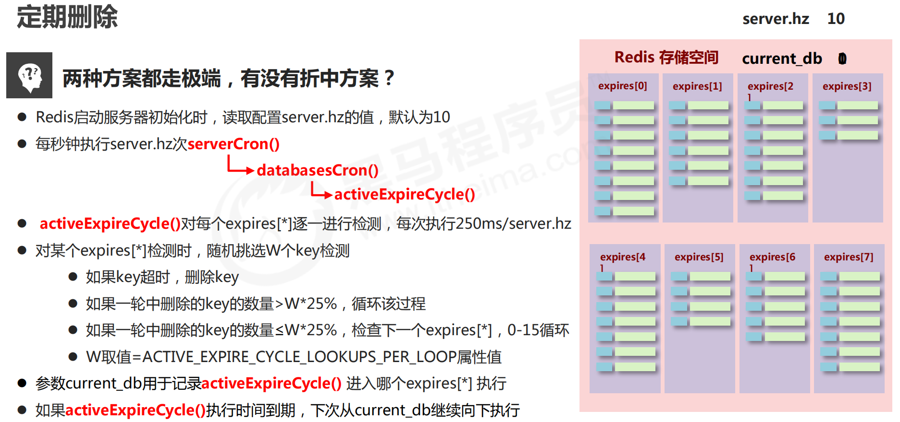

### 过期数据删除策略
- 定时删除
  - 介绍：当 key 的定时器过期时立刻对 key 进行删除。
  - 优点：节约内存，快速释放空间。
  - 缺点：CPU压力大，无论当前 CPU 的负载多高均会立刻执行；影响Redis服务器的响应时间和指令吞吐量。
  - 总结：用时间换空间
- 惰性删除
  - 介绍：数据到达过期时间，不做处理。等下次访问该数据时：如果未过期，返回数据；发现已过期，删除，返回不存在。
  - 优点：节约 CPU 性能，发现必须删除的时候才删除。
  - 缺点：内存压力很大，出现长期占用内存的数据。
  - 总结： 用空间换时间
- 定期删除
  - 介绍：一种折中方案，使用轮询的方式周期性的检查数据库和 key ，并且对过期的 key 进行删除。周期性轮询 Redis 数据库中的时效性数据，采用随机抽取的策略，利用过期数据占比的方式控制删除额度。
  - **原理**：Redis 启动服务器初始化时，读取配置文件中 ```server.hz``` 的值，默认为 10 ；每秒钟执行 ```server.hz``` 次 ```serverCron()``` ；执行 ```serverCron()``` 时会在单个数据库执行 ```databasesCron()``` ；执行 ```databasesCron()``` 时会对 key 执行 ```activeExpireCycle()``` ；执行 ```activeExpireCycle()``` 时会随机挑选 W 个 key 进行检测：
    - 如果 key 超时，删除 key ；
    - 如果一轮中删除的 key 的数量 > W*25% ，循环该过程；
    - 如果一轮中删除的 key 的数量 ≤ W*25% ，检查下一个 expires[*] ，0-15 循环；
    - W 取值= ```ACTIVE_EXPIRE_CYCLE_LOOKUPS_PER_L``` 。

   

  - 特点：① CPU 性能占用设置有峰值，检测频度可自定义设置；② 内存压力不是很大，长期占用内存的冷数据会被持续清理。
  - 总结：周期性抽查存储空间（随机抽查，重点抽查）

Redis 采用的是**惰性删除**和**定期删除**两种策略。

#### 持久化和复制对过期键的处理
- RDB 持久化
  - 主服务器：RDB 文件无论是生成还是载入，都会对过期键进行检查：生成时，过期键不写入；载入时，过期键会忽略。
  - 从服务器：载入时，不会检查是否过期，都会载入。
- AOF 持久化：AOF 文件写入时，过期数据未删除，不影响；键过期已删除，则在 AOF 文件后追加 DEL 命令。
- AOF 重写：AOF 重写过程中会进行检查，过期的键会忽略。
- 复制：主从模式下，由主服务器进行删除过期键，并显式地向服务器发送 DEL 命令；从服务器自身不具备删除过期键的行为。

### 内存淘汰机制（逐出算法）
Redis 默认使用的是 LRU 算法。
- 介绍：
  - 新的问题：当内存满了又有新数据进入怎么办？需要一种算法决定应该删除哪个数据确保新的数据有足够的空间储存在 Redis 中。
  - 当新数据进入 Redis 的时候会先调用 ```freeMemorylfNeeded()``` 检测内存空间是否充足，
如果内存不满足新加数据的最低存储需求，Redis 要临时删除一些数据为当前指令清理存储空间。清理数据的算法称为**逐出算法**。逐出数据的过程不是100%能清理出足够的内存，如果不成功则反复执行，如果对所有数据尝试后仍然达不到需求就会报错。
- 算法：
  - （1）检测易失数据
（可能会过期的数据集 ```server.db[i].expires``` ）
    - volatile-lru：挑选最近最久未使用的数据淘汰
    - volatile-lfu：挑选最近使用次数最少的数据淘汰
    - volatile-ttl：挑选将要过期的数据淘汰
    - volatile-random：任意选择数据淘汰
  - （2） 检测全库数据
（所有数据集 ```server.db[i].dict``` ）
    - allkeys-lru：挑选最近最少使用的数据淘汰
    - allkeys-lfu：挑选最近使用次数最少的数据淘汰
    - allkeys-random：任意选择数据淘汰
  - （3）放弃数据驱逐
    - ⑧ no-enviction：禁止驱逐数据（redis4.0中默认策略），会引发错误OOM（Out Of Memory）
