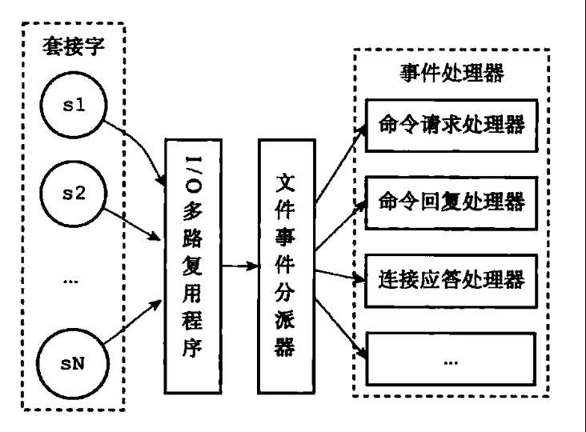

### Redis 单线程模型详解

Redis 基于 Reactor 模式来设计开发了自己的一套高效的事件处理模型 （Netty 的线程模型也基于 Reactor 模式，Reactor 模式不愧是高性能 IO 的基石），这套事件处理模型对应的是 Redis 中的文件事件处理器（file event handler）。由于文件事件处理器（file event handler）是单线程方式运行的，所以我们一般都说 Redis 是单线程模型。

既然是单线程，那怎么监听大量的客户端连接呢？

Redis 通过 IO 多路复用程序 来监听来自客户端的大量连接（或者说是监听多个 socket ），它会将感兴趣的事件及类型（读、写）注册到内核中并监听每个事件是否发生。

这样的好处非常明显：**I/O 多路复用技术的使用让 Redis 不需要额外创建多余的线程来监听客户端的大量连接，降低了资源的消耗**（和 NIO 中的 Selector 组件很像）。

另外， Redis 服务器是一个事件驱动程序，服务器需要处理两类事件：1. 文件事件; 2. 时间事件。

时间事件不需要多花时间了解，我们接触最多的还是 文件事件（客户端进行读取写入等操作，涉及一系列网络通信）。

《Redis 设计与实现》有一段话是如是介绍文件事件的：
> Redis 基于 Reactor 模式开发了自己的网络事件处理器：这个处理器被称为文件事件处理器（ file event handler）。文件事件处理器使用 I/O 多路复用（multiplexing）程序来同时监听多个套接字，并根据套接字目前执行的任务来为套接字关联不同的事件处理器。
当被监听的套接字准备好执行连接应答（accept）、读取（read）、写入（write）、关 闭（close）等操作时，与操作相对应的文件事件就会产生，这时文件事件处理器就会调用套接字之前关联好的事件处理器来处理这些事件。
虽然文件事件处理器以单线程方式运行，但通过使用 I/O 多路复用程序来监听多个套接字，文件事件处理器既实现了高性能的网络通信模型，又可以很好地与 Redis 服务器中其他同样以单线程方式运行的模块进行对接，这保持了 Redis 内部单线程设计的简单性。

可以看出，文件事件处理器（file event handler）主要是包含 4 个部分：
- 多个 socket（客户端连接）
- IO 多路复用程序（支持多个客户端连接的关键）
- 文件事件分派器（将 socket 关联到相应的事件处理器）
- 事件处理器（连接应答处理器、命令请求处理器、命令回复处理器）

### Redis 没有使用多线程？为什么不使用多线程？

虽然说 Redis 是单线程模型，但是，实际上，Redis 在 4.0 之后的版本中就已经加入了对多线程的支持。

不过，Redis 4.0 增加的多线程主要是针对一些大键值对的删除操作的命令，使用这些命令就会使用主处理之外的其他线程来“异步处理”。

大体上来说，Redis 6.0 之前主要还是单线程处理。

Redis 6.0 之前 为什么不使用多线程？
我觉得主要原因有下面 3 个：
- 单线程编程容易并且更容易维护；
- Redis 的性能瓶颈不在 CPU ，主要在内存和网络；
- 多线程就会存在死锁、线程上下文切换等问题，甚至会影响性能。

Redis 6.0 引入多线程主要是为了提高网络 IO 读写性能，因为这个算是 Redis 中的一个性能瓶颈（Redis 的瓶颈主要受限于内存和网络）。

虽然，Redis 6.0 引入了多线程，但是 Redis 的多线程只是在网络数据的读写这类耗时操作上使用了，执行命令仍然是单线程顺序执行。因此，你也不需要担心线程安全问题。
