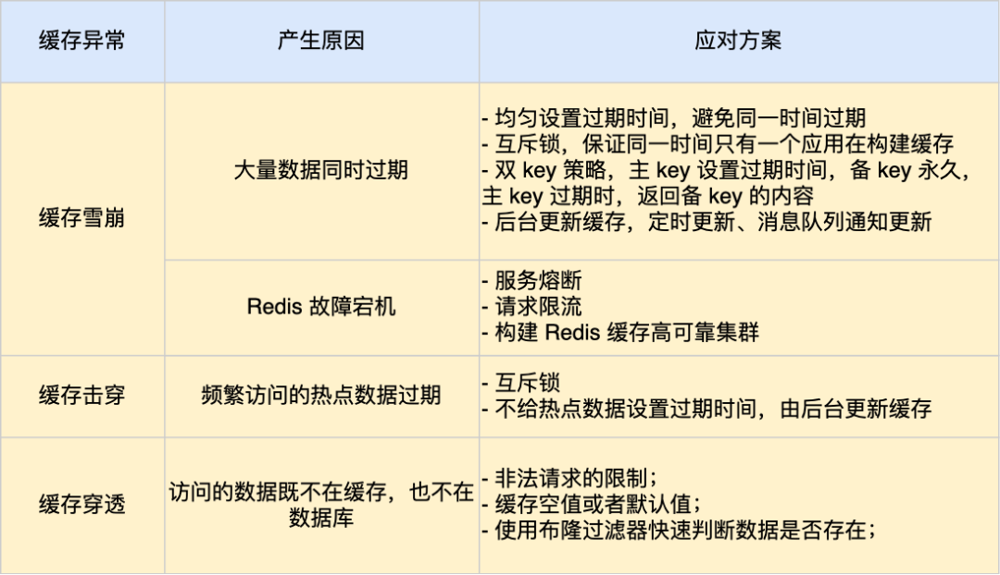

### Redis 缓存雪崩、缓存击穿、缓存穿透
用户的数据一般都是存储于数据库，数据库的数据是落在磁盘上的，**磁盘的读写速度慢**。当用户的请求，都访问数据库的话，请求数量一上来，数据库很容易崩溃，所以为了**避免用户直接访问数据库**，会用 Redis 作为缓存层。
因为 Redis 是内存数据库，我们可以将数据库的数据缓存在 Redis 里，相当于数据缓存在内存，内存的读写速度比硬盘快好几个数量级，这样大大提高了系统性能。

引入了缓存层，就会有缓存异常的三个问题，分别是**缓存雪崩**、**缓存击穿**、**缓存穿透**。

#### 缓存雪崩
当大量缓存数据在同一时间过期（失效）或者 Redis 故障宕机时，如果此时有大量的用户请求，都无法在 Redis 中处理，于是全部请求都直接访问数据库，从而导致数据库的压力骤增，严重的会造成数据库宕机，从而形成一系列连锁反应，造成整个系统崩溃，这就是缓存雪崩的问题。

###### 应对策略
① 由于大量数据同时过期：
  - 均匀设置过期时间
  - 互斥锁
  - 双 key 策略
  - 后台更新缓存

② 由于 Redis 故障宕机
  - 服务熔断或请求限流机制
  - 构建 Redis 缓存高可靠集群

#### 缓存击穿
如果缓存中的某个热点数据过期了，此时大量的请求访问了该热点数据，就无法从缓存中读取，直接访问数据库，数据库很容易就被高并发的请求冲垮，这就是缓存击穿的问题。

###### 应对策略
- 互斥锁方案，保证同一时间只有一个业务线程更新缓存，如未能获取互斥锁的请求，要么等待锁释放后重新读取缓存，要么就返回空值或者默认值。
- 不给热点数据设置过期时间，由后台异步更新缓存，或者在热点数据准备要过期前，提前通知后台线程更新缓存以及重新设置过期时间。

#### 缓存穿透
当用户访问的**数据，既不在缓存中，也不在数据库中**，导致请求在访问缓存时，发现缓存缺失，再去访问数据库时，发现数据库中也没有要访问的数据，没办法构建缓存数据，来服务后续的请求。那么当有大量这样的请求到来时，数据库的压力骤增，这就是缓存穿透的问题。

###### 应对策略
- 第一种方案，非法请求的限制
- 第二种方案，缓存空值或者默认值
- 第三种方案，使用布隆过滤器快速判断数据是否存在，避免通过查询数据库来判断数据是否存在

### 总结
缓存异常会面临的三个问题：缓存雪崩、缓存击穿和缓存穿透。

其中，**缓存雪崩和缓存击穿**主要原因是**数据不在缓存中，而导致大量请求访问了数据库，数据库压力骤增，容易引发一系列连锁反应，导致系统奔溃**。不过，一旦数据被重新加载回缓存，应用又可以从缓存快速读取数据，不再继续访问数据库，数据库的压力也会瞬间降下来。因此，缓存雪崩和缓存击穿应对的方案比较类似。

而**缓存穿透**主要原因是数据既不在缓存也不在数据库中。

因此，缓存穿透与缓存雪崩、击穿应对的方案不太一样。

