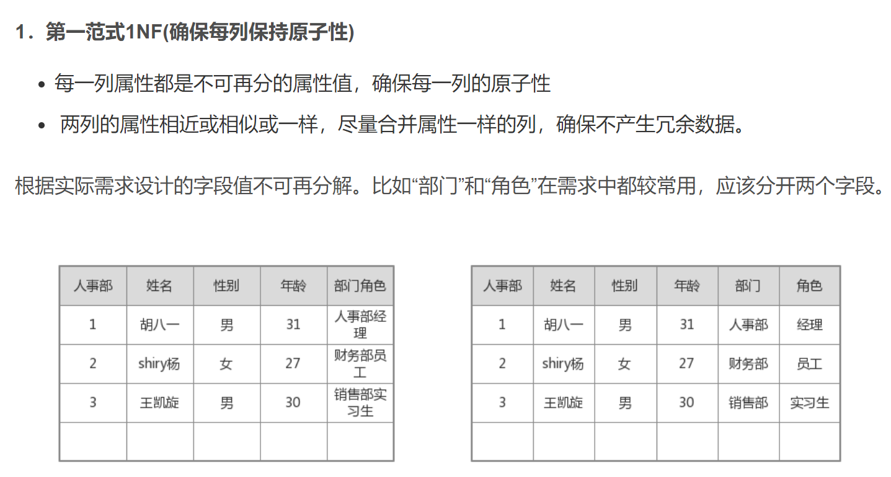
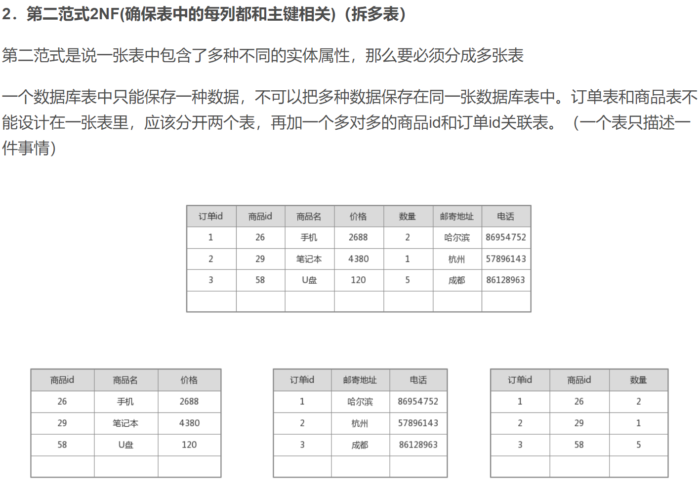
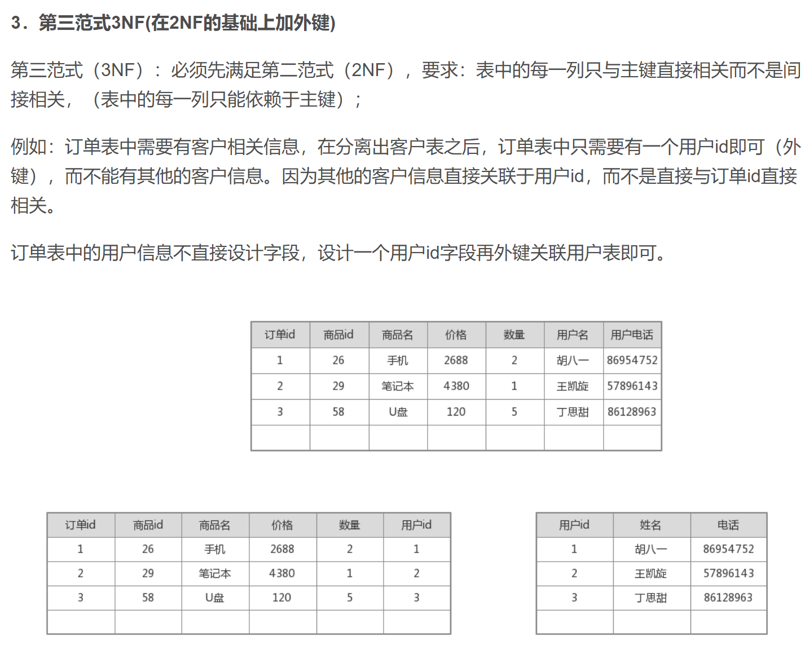

### 数据库设计范式
#### 第一范式
在任何一个关系数据库中，第一范式（ 1NF ）是对关系模式的基本要求，不满足第一范式（ 1NF ）的数据库就不是关系数据库。

#### 第二范式
**2NF** 第二范式建立在第一范式的基础上，即满足第二范式一定满足第一范式，第二范式要求数据表每一个实例或者行必须被唯一标识。除满足第一范式外还有两个条件，一是表必须有一个主键；二是没有包含在主键中的列必须完全依赖于主键，而不能只依赖于主键的一部分。

#### 第三范式
若某一范式是第二范式，且每一个非主属性都不传递依赖于该范式的候选键，则称为第三范式，即不能存在：非主键列 A 依赖于非主键列 B，非主键列 B 依赖于主键的情况。

#### BC 范式
BCNF 在第三范式的基础上，数据库表中如果不存在任何字段对任一候选关键字段的传递函数依赖则符合第三范式。

#### 总结
- 第一范式：每个列都不可以再拆分。

- 第二范式：在第一范式的基础上，非主键列完全依赖于主键，而不能是依赖于主键的一部分。一张表只描述一件事情。

- 第三范式：在第二范式的基础上，非主键列只依赖于主键，不依赖于其他非主键。用外键做表的关联。
