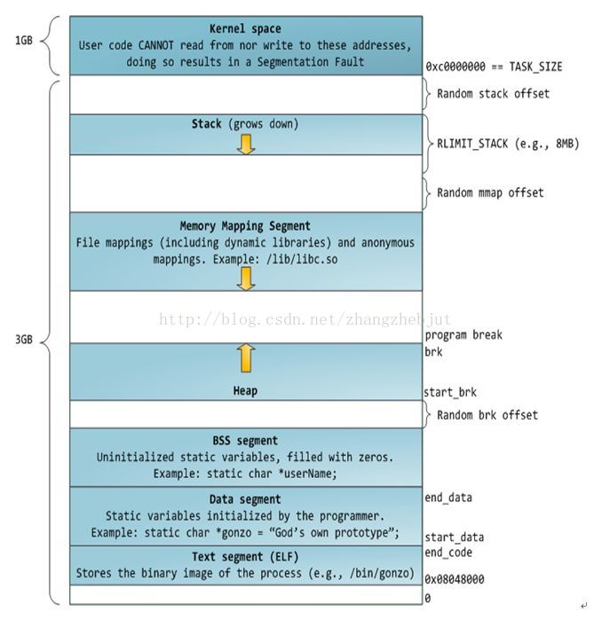

## 操作系统如何进行内存管理

为了在多进程环境下，使得进程之间的内存地址不受影响，相互隔离，操作系统为每个内存分配了独立的一套**虚拟地址空间**，每个程序只关心自己的虚拟地址就可以。

每个进程都有自己的虚拟空间，而物理内存只有一个，所以当启用了大量进程，物理内存必然会紧张，于是操作系统会通过**内存交换**技术，把不常使用的内存暂时存放到硬盘（换出），在需要的时候再装载回物理内存（换入）。

操作系统来维护虚拟地址与物理地址的映射关系，可以有**分段**和**分页**的方式，或者两者结合。

**内存分段**是根据程序的逻辑角度，分成了栈段、堆段、数据段、代码段等，这样可以分离出不同属性的段，同时是一块连续的空间。但是每个段的大小都不统一，这会导致**内存碎片**和**内存交换效率低**的问题。**内存分页**可以解决这两个问题，内存分页把虚拟空间和物理空间分成大小固定的页，如在 Linux 系统中，每一页的大小为 **4KB** 。分页之后，就不会产生细小的内存碎片，同时在内存交换的时候，写入硬盘也就一个页或几个页，这大大提高了内存交换的效率。

**多级页表**了解决简单分页产生的**页表过大**的问题，它解决了空间上的问题，但这会导致 CPU 在寻址的过程中，需要有很多层表参与，加大了时间上的开销。于是根据程序的**局部性原理**，在 CPU 芯片中加入了快表（ **TLB** ），负责缓存**最近常被访问的页表项**，大大提高了地址的转换速度。

## Linux 采用了哪种方式进行内存管理？
Linux 内存主要采用的是**页式**内存管理，但同时涉及了**段**机制。

Linux 系统中的每个段都是从 0 地址开始的整个 4GB 虚拟空间（32位环境下），也就是所有的段的起始地址都是一样的。这意味着，Linux 系统中的代码，包括操作系统本身的代码和应用程序代码，所面对的地址空间都是线性地址空间（虚拟地址），这种做法相当于屏蔽了处理器中的逻辑地址概念，段只被用于访问控制和内存保护。

### Linux 的虚拟地址空间（从高位到低位）
在 Linux 操作系统中，虚拟地址空间的内部被分为内核空间和用户空间两部分。

内核空间、栈、内存映射段、堆、BSS、数据段、程序段。

- **内核空间**：Linux的虚拟地址空间范围为0～4GB， Linux 内核将这 4GB 的空间分为两部分， 将最高的 1GB （从虚拟地址0xC0000000到0xFFFFFFFF）供内核使用，称为“内核空间”。而将较低的3G字节（从虚拟地址0x00000000到0xBFFFFFFF）供各个进程使用，称为“用户空间。因为每个进程可以通过系统调用进入内核，因此，Linux内核由系统内的所有进程共享。于是，从具体进程的角度来看，每个进程可以拥有 4GB 的虚拟空间。
- **栈**：包括局部变量和函数调用的上下文等。栈的大小是固定的，一般是 8MB 。系统也提供了参数，以便我们自定义大小。
- **内存映射段**：包括**动态**库、共享内存等，从低地址开始向上增长（与硬件和内核版本有关）。
- **堆**：包括**动态**分配的内存，从低地址开始向上增长。
- **BSS**：未初始化过的数据(BSS)，在程序运行初未对变量进行初始化的数据。
- **数据段**(.data)：初始化过的数据(Data)，在程序运行初已经对变量进行初始化的数据。
- **程序段**(.text)：程序代码在内存中的映射，存放函数体的二进制代码。
