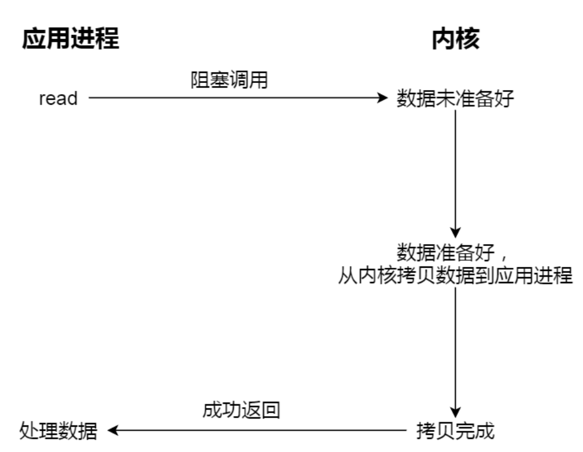
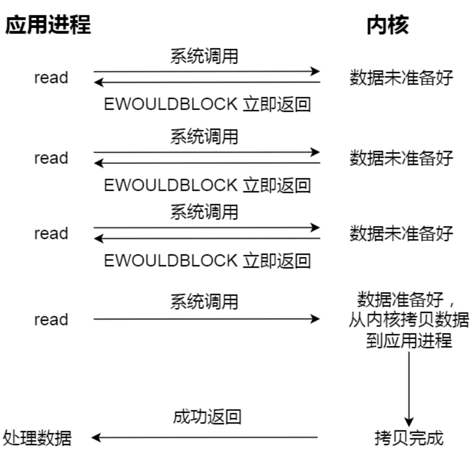
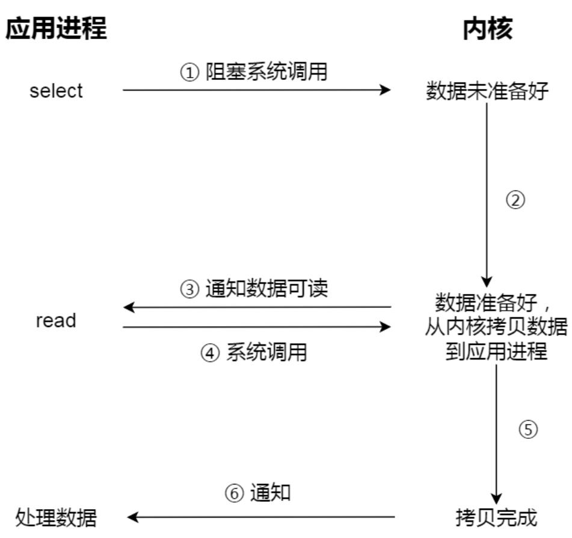
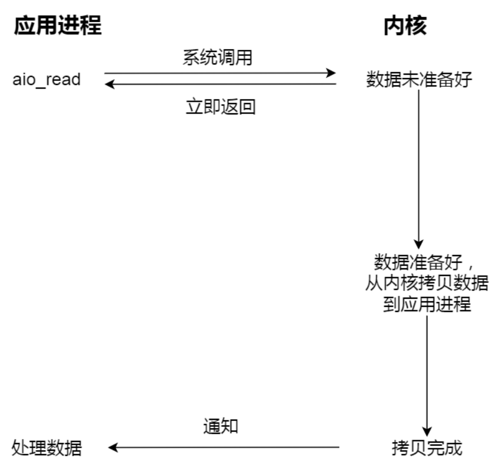
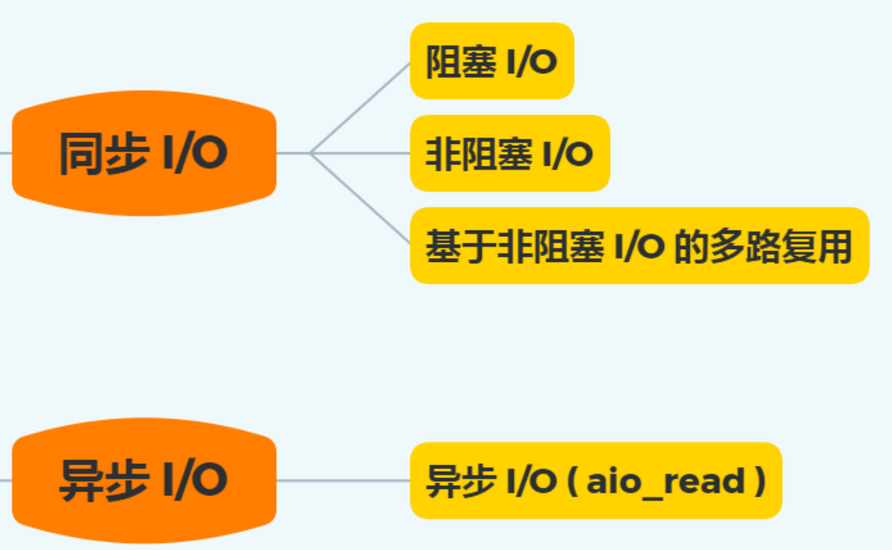

### 文件 I/O
文件的读写方式各有千秋，对于文件的 I/O 分类也非常多，常见的有：
- 缓冲与非缓冲 I/O
- 直接与非直接 I/O
- 阻塞与非阻塞 I/O VS 同步与异步 I/O

#### 缓冲与非缓冲 I/O
文件操作的标准库是可以实现数据的缓存，那么根据**是否利用标准库缓存，可以把文件 I/O 分为缓冲 I/O 和 非缓冲 I/O** ：
- 缓冲 I/O ：利用的是标准库的缓存实现文件的加速访问，而标准库再通过系统调用访问文件。
- 非缓冲 I/O ：直接通过系统调用访问文件，不经过标准库缓存。

这里所说的缓冲特指标准库内部实现的缓冲。比如，很多程序遇到换行时才真正输出，而换行前的内容，其实就是被标准库暂时缓存了起来，这样做的目的是，减少系统调用的次数，因为系统盗调用是有 CPU 上下文切换的开销的。

#### 直接与非直接 I/O
磁盘 I/O 是非常慢的，所以 Linux 内核为了减少磁盘 I/O 次数，在系统调用后，会把用户数据拷贝到内核中缓存起来，这个内核缓存空间就是**页缓存**，只有当缓存满足某些条件的时候，才发起磁盘 I/O 的请求。
那么，根据**是否利用操作系统的缓存**，可以把文件 I/O 分为直接 I/O 与 非直接 I/O：
- 直接 I/O ：不会发生内核缓存和用户程序之间数据复制，而是直接经过文件系统访问磁盘。
- 非直接 I/O ：读操作时，数据从内核缓存中拷贝给用户程序，写操作时，数据从用户程序拷贝给内核缓存，再由内核决定什么时候写入数据到磁盘。

如果在使用文件操作类的系统调用函数时，指定了 ```O_DIRECT``` 标志，则表示使用直接 I/O 。若没有设置过，则默认使用的是非直接 I/O 。

##### 如果用了非直接 I/O 进行写数据操作，内核什么情况下才会把缓存数据写入到磁盘？
以下几种场景会触发内核缓存的数据写入磁盘：
- 在调用 ```write``` 的最后，当发现内核缓存的数据太多的时候，内核会把数据写到磁盘上；
- 用户主动调用 ```sync``` ，内核缓存会刷到磁盘上；
- 当内存十分紧张，无法再分配页面时，也会把内核缓存的数据刷到磁盘上；
- 内核缓存的数据的缓存时间超过某个时间时，也会把数据刷到磁盘上。

#### 阻塞与非阻塞 I/O VS 同步与异步 I/O
阻塞与非阻塞 I/O VS 同步与异步 I/O ，放在一起说因为它们相似，容易混淆。

##### 阻塞 I/O
当用户程序执行 ```read``` ，线程会被阻塞，一直等到内核数据准备好，并把数据从内核缓冲区拷贝到应用程序的缓冲区中，当拷贝过程完成， ```read``` 才会返回。
阻塞等待的是**内核数据准备好**和**数据从内核态拷贝到用户态**这两个过程。


##### 非阻塞 I/O
非阻塞的 ```read``` 请求在数据未准备好的情况下立即返回，可以继续往下执行，此时应用程序不断轮询内核，知道数据准备好，内核将数据拷贝到应用程序缓冲区， ```read``` 调用才可以获取到结果。

**这里最后一次 ```read``` 调用，获取数据的过程，是一个同步的过程，是需要等待的过程。这里的同步指的是内核态的数据拷贝到用户程序的缓冲区这个过程**。
举例，访问管道或 socket 时，如果设置了 ```O_NONBLOCK```标志，那么就表示使用的非阻塞 I/O 的方式访问，而不做任何设置的话，默认是阻塞 I/O 。

应用程序每次轮询内核的 I/O 是否准备好，感觉有点傻乎乎，因为在轮询的过程中，应用程序什么都做不了，只是在循环。为了解决这种傻乎乎的轮询方式，于是， **I/O 多路复用**技术就出来了。如 select 、 poll ，它是通过 I/O 事件分发，当内核数据准备好时，再以事件通知应用程序进行操作。
这个做法大大改善了应用程序对 CPU 的利用率，在没有被通知的情况下，应用程序可以使用 CPU 做其他的事情。

#### 同步 I/O
```read```获取数据的过程（数据从内核态拷贝到用户态的过程），也是一个**同步的过程**，需要等待。

实际上，无论是阻塞 I/O 、非阻塞 I/O ，还是基于非阻塞 I/O 的多路复用都是同步调用。因为它们在```read``` 调用时，内核将数据从内核空间拷贝到应用程序空间，过程都是需要等待的，即这个过程是同步的，如果内核实现的拷贝效率不高，```read``` 调用就会在这个同步过程中等待比较长的时间。

#### 异步 I/O
真正的异步 I/O 是**内核数据准备好**和**数据从内核态拷贝到用户态**这两个过程都不用等待。
当发起```aio_read``` 之后，就立即返回，内核自动将数据从内核空间拷贝到应用程序空间，这个拷贝过程同样是异步的，内核自动完成的，和前面的同步操作不一样，应用程序并不需要主动发起拷贝动作。


### 总结

I/O 是分为两个过程的：
1. 数据准备的过程
2. 数据从内核空间拷贝到用户进程缓冲区的过程

阻塞 I/O 会阻塞在**过程 1 和过程 2**；而非阻塞 I/O 和基于非阻塞 I/O的多路复用只会阻塞在过程 2 ，所以这三个都可以认为是同步 I/O 。
异步 I/O 则不同，过程 1 和过程 2 都不会阻塞。

#### 用故事理解这几种 I/O 模型
你去食堂吃饭，你好比用户程序，食堂好比操作系统。
- **阻塞 I/O** ，你去食堂吃饭，但是食堂的菜还没做好，于是你就一直在那里等啊等，等了好长一段时间终于等到食堂阿姨把菜端了出来（数据准备的过程），但是你还要继续等阿姨把菜（内核空间）打到你的餐盘里（用户空间），经历完这两个过程你才可以离开。
- **非阻塞 I/O** ，你去食堂吃饭，问阿姨菜做好了没有，阿姨告诉你还没有，你就离开了；过了一段时间，你又来问，阿姨说做好了，于是阿姨把菜打到你的餐盘里，这个过程需要等待。
- **基于非阻塞的 I/O 多路复用**，你去食堂吃饭，发现有一排窗口，食堂阿姨告诉你这些窗口都还没有做好菜，等做好了再告诉你，于是你等啊等（```select``` 调用中），过了一会儿阿姨告诉你菜做好了，但是不知道那个窗口的菜做好了，你自己去看。于是你一个窗口一个窗口去确认，发现某个窗口菜做好了，于是你让某个窗口的阿姨把菜打到餐盘里，这个打菜过程需要等待。打完菜后你就可以离开了。
- **异步 I/O**，你让食堂阿姨将菜做好并把菜打到餐盘里后，把餐盘送到你面前，整个过程你都不需要等待。
