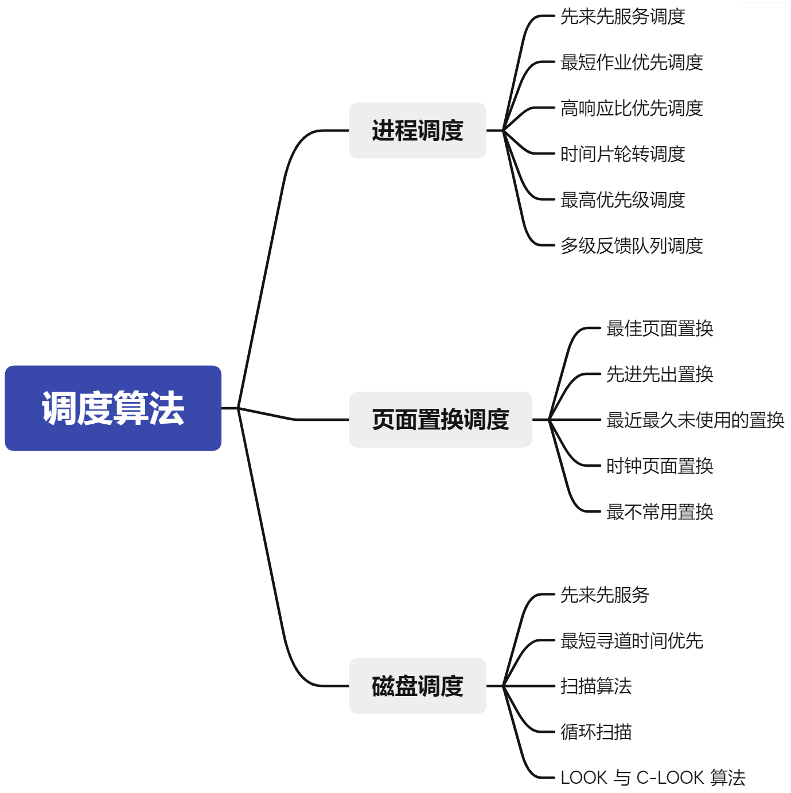
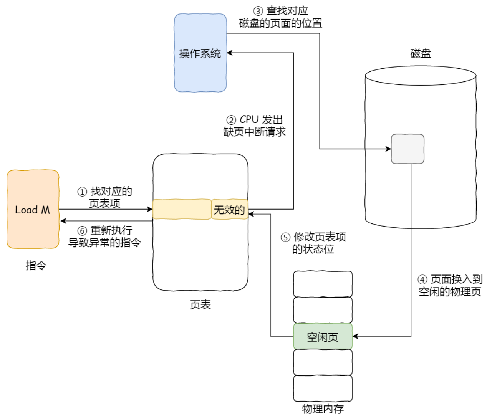
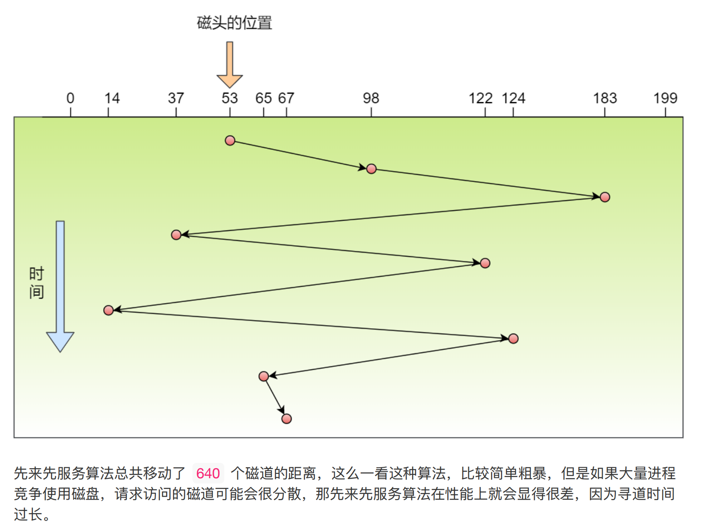
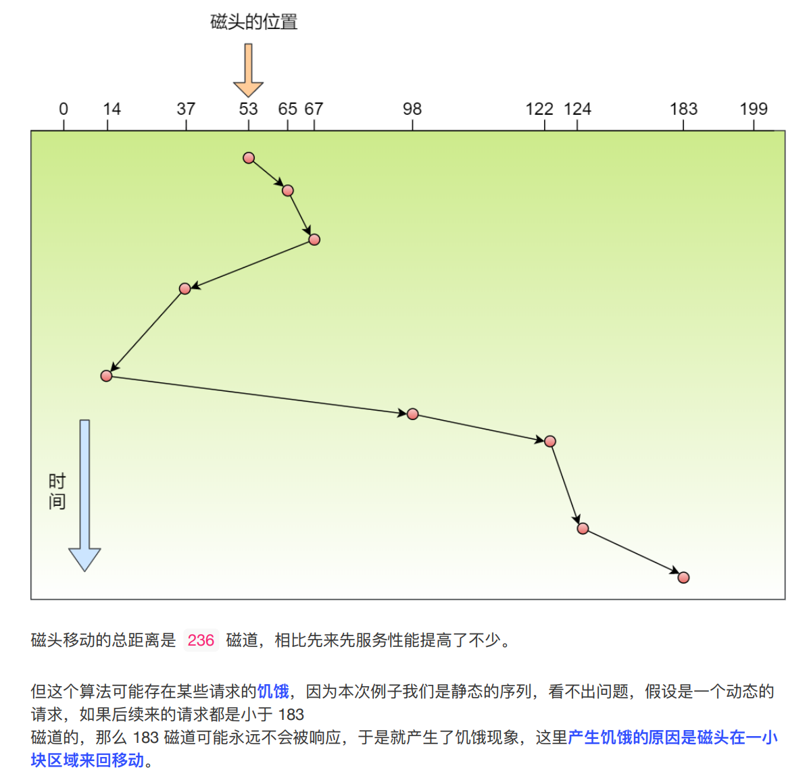
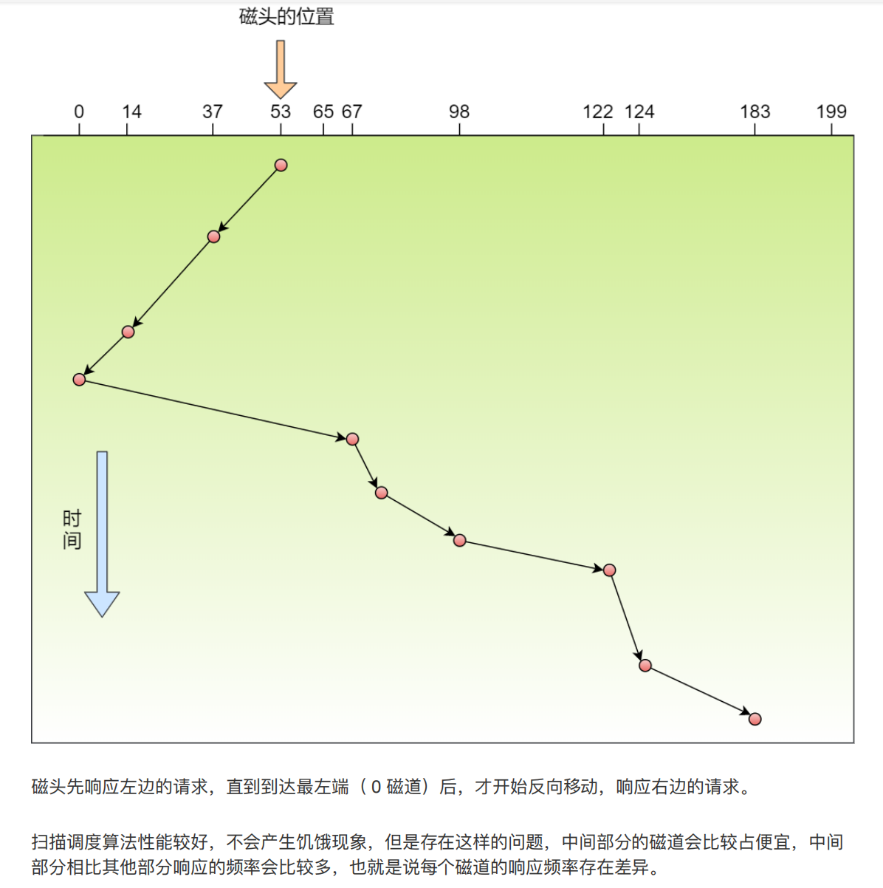
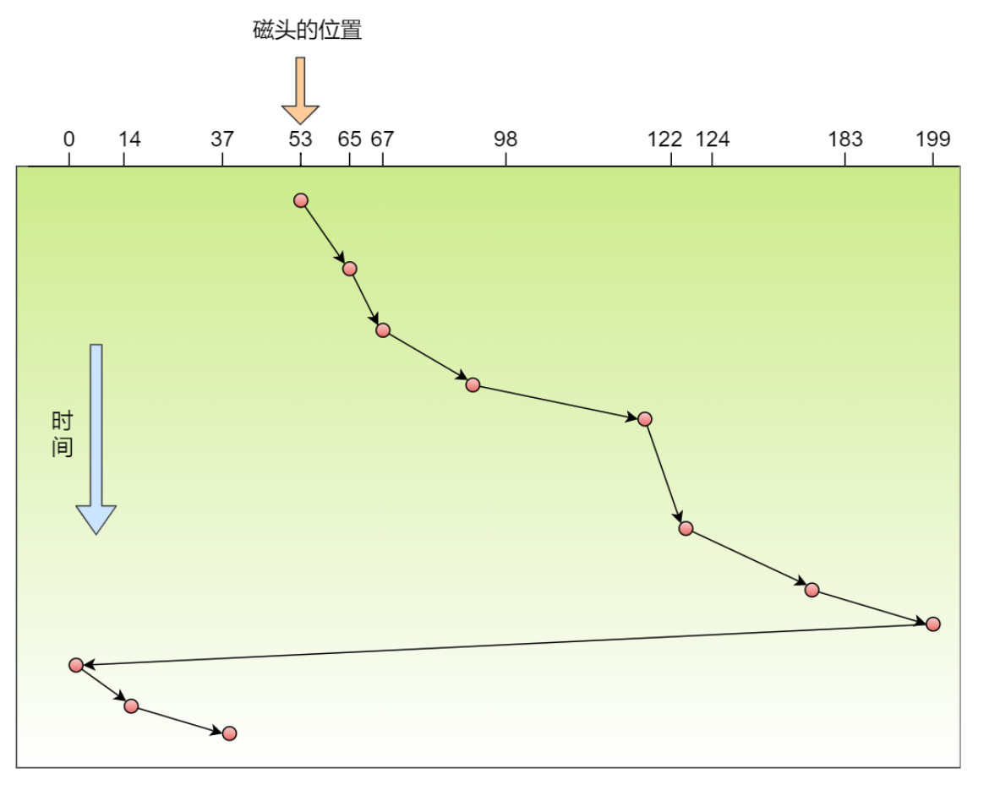
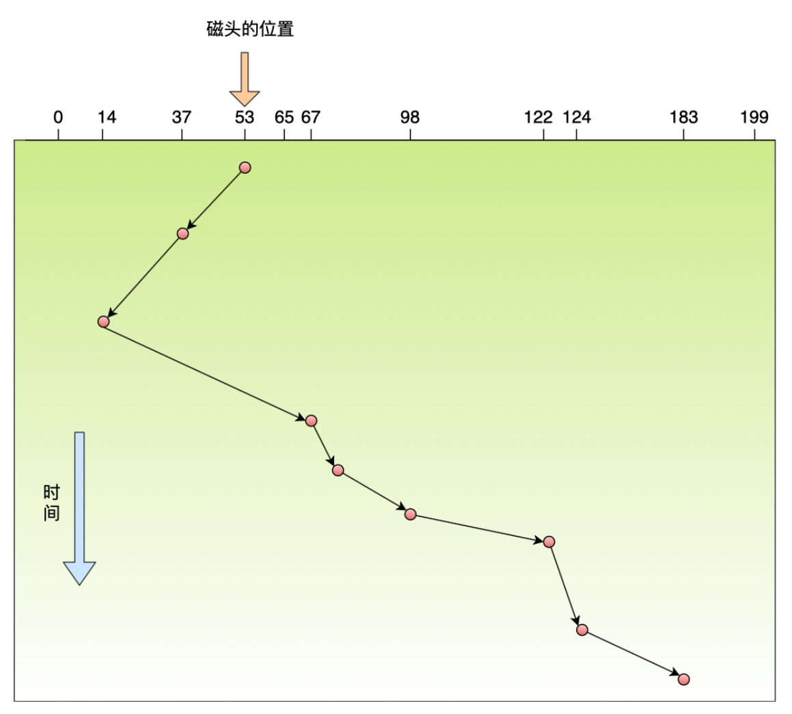
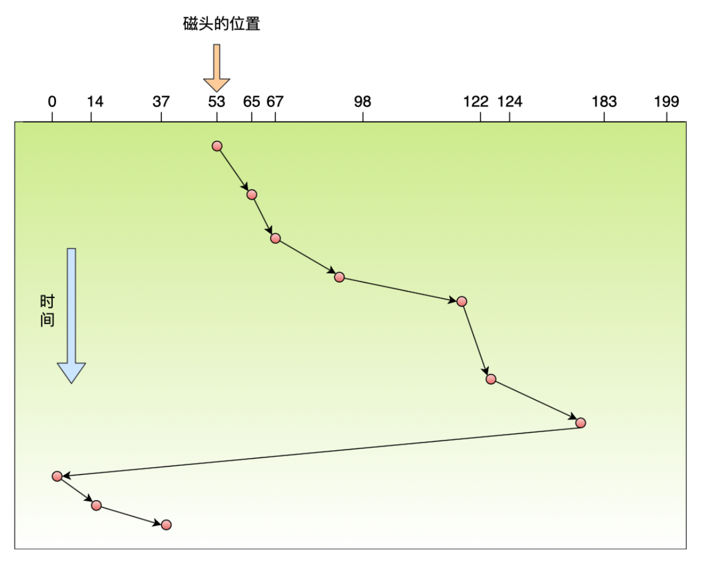

### 调度算法



#### 进程调度算法
当 CPU 空闲时，操作系统就选择内存中某个**就绪状态**的进程，并给其分配 CPU 。发生 CPU 调度的情况：
- ① 当进程从运行状态转到等待状态；
- ② 当进程从运行状态转到就绪状态；
- ③ 当进程从等待状态转到就绪状态；
- ④ 当进程从运行状态转到终止状态。

其中发生在 ① 和 ④ 两种情况下的调度称为**非抢占式调度**，② 和 ③ 两种情况下发生的调度称为**抢占式调度**。

非抢占式：当进程正在运行时，它就会一直运行，直到该进程完成或发生某个事件而被阻塞时，才会把 CPU 让给其他进程。

抢占式调度：在进程运行时，可以被打断，使其把 CPU 让给其他进程。抢占的原则一般有三种：时间片原则、优先权原则、短作业优先原则。

调度算法影响的是等待时间（进程在就绪队列中等待调度的时间总和），而不能影响进程正在使用 CPU 的时间和 I/O 时间。

##### 先来先服务调度算法
最简单的调度算法，非抢占式的先来先服务（First Come First Serverd, FCFS）算法。

先来后到，每次从就绪队列选择最先入队列的进程，然后一直运行，直到进程退出或被阻塞，才会继续从队列中选择第一个进程继续运行。

但当一个长作业先运行，那么后面的短作业等待的时间就会很长，利于短作业。
- 算法优点：易于理解且实现简单，只需要一个队列（FIFO），且相当公平。
- 算法缺点：比较有利于长进程，而不利于短进程，有利于CPU 繁忙的进程，而不利于I/O 繁忙的进程。

##### 短作业（进程）优先调度算法
短作业优先（Shortest Job First, SJF）是对FCFS算法的改进，其目标是减少平均周转时间。该算法会优先选择运行时间最短的进行来运行，这有助于提高系统的吞吐量。

该算法对长作业不利，很容易造成一种极端现象。比如，一个长作业在就绪队列等待运行，而这个就绪队列有非常多的短作业，那么就会使得长作业不断往后推，周转时间变长，致使长作业长期不会被运行。

- 算法优点：相比 FCFS 算法，该算法可改善平均周转时间和平均带权周转时间，缩短进程的等待时间，提高系统的吞吐量。
- 算法缺点：对长进程非常不利，可能长时间得不到执行，且未能依据进程的紧迫程度来划分执行的优先级，以及难以准确估计进程的执行时间，从而影响调度性能。

##### 高响应比优先调度算法
高响应比优先（Highest Response Ratio Next, HRRN）调度算法权衡了短作业和长作业，是对 FCFS 方式和 SJF 方式的一种综合平衡。
FCFS 方式只考虑每个作业的等待时间而未考虑执行时间的长短，而 SJF 方式只考虑执行时间而未考虑等待时间的长短。因此，这两种调度算法在某些极端情况下会带来某些不便。

每次进行进程调度时，先计算**响应比优先级**，然后把响应比优先级最高的进程投入运行，响应比优先级的计算公式：

 $$ 优先权 = \frac{等待时间 + 要求服务时间}{要求服务时间} $$

从上面的公式可以发现：
- 如果两个进程的等待时间相同，要求的服务时间越短，响应比就越高，这样短作业的进程容易被选中运行。
- 如果两个进程要求的服务时间相同，等待时间越长，响应比越高，这就兼顾到了长作业进程。因为进程的响应比可以随时间等待的增加而提高，当其等待时间足够长时，其响应比便可以升到很高，从而获得运行的机会。
###### 优缺点
- 算法优点：由于长作业也有机会投入运行，在同一时间内处理的作业数显然要少于SJF法，从而采用HRRN方式时其吞吐量将小于采用SJF 法时的吞吐量。
- 算法缺点：由于每次调度前要计算响应比，系统开销也要相应增加。

##### 时间片轮转调度算法
时间片轮转（Round Robin, RR）调度算法采用剥夺策略。时间片轮转调度是一种最古老，最简单，最公平且使用最广的算法。每个进程被分配一个时间段，称作它的时间片，即该进程允许运行的时间。

- 算法原理：让就绪进程以 FCFS 的方式按时间片轮流使用 CPU 的调度方式，即将系统中所有的就绪进程按照 FCFS 原则，排成一个队列，每次调度时将 CPU 分派给队首进程，让其执行一个时间片，时间片的长度从几毫秒到几百毫秒。在一个时间片结束时，发生时钟中断，调度程序据此暂停当前进程的执行，将其送到就绪队列的末尾，并通过上下文切换执行当前的队首进程，进程可以未使用完一个时间片，就出让 CPU（如阻塞）。
  - 如果时间片用完，进程还在运行，那么将会把此进程从 CPU 释放出来，并把 CPU 分配给另外一个进程；
  - 如果该进程在时间片结束前阻塞或结束，则 CPU 立即进行切换。

- 算法优点：时间片轮转调度算法的特点是简单易行、平均响应时间短。
- 算法缺点：不利于处理紧急作业。在时间片轮转算法中，时间片的大小对系统性能的影响很大，因此时间片的大小应选择恰当。

- 怎样确定时间片的大小：① 系统对响应时间的要求；② 就绪队列中进程的数目；③ 系统的处理能力。
  - 如果时间片设置得太短会导致过多的进程上下文切换，降低了 CPU 效率。
  - 如果时间片设置太长又可能引起对短作业进程的响应时间变长。

##### 最高优先级调度算法
在就绪队列中选择优先级最高的进程来执行，这称为最高优先级（Highest Priority First, HPF）调度算法。

进程的优先级可以分为静态优先级或动态优先级：
- 静态优先级：创建进程时，就已经确定了优先级，然后整个运行时间优先级都不会变化；
- 动态优先级：根据进程的动态变化调整优先级。如，如果进程运行时间增加，则降低其优先级；如果等待时间（就绪队列的等待时间）增加，则升高其优先级，也就是随着时间的推移增加等待进程的优先级。

非抢占式和抢占式：
- 非抢占式：当就绪队列中出现优先级高的进程，运行完当前进程，再选择优先级高的进程。
适用：批处理系统，实时性要求不高的实时系统。
- 抢占式：当就绪队列中出现优先级更高的进程，当前进程挂起，调度优先级高的进程运行。适用：实时性要求高的实时系统，对性能要求高的批处理和分时系统。

缺点：可能会导致低优先级的进程永远不会运行。

##### 多级反馈队列调度算法
多级反馈队列（Multillevel Feedback Queue）调度算法是**时间片轮转**和**最高优先级**调度算法的综合和发展。
- **多级**表示有多个队列，每个队列优先级从高到低，同时优先级越高时间片越短。
- **反馈**表示如果有新的进程加入优先级高的队列时，立刻停止当前正在运行的进程，转而去运行优先级高的队列。

- 算法原理：
  - 设置了多个队列，赋予每个队列不同的优先级，每个队列优先级从高到低，同时优先级越高时间片越短；
  - 对于同一个队列中的各个进程，按照时间片轮转调度。新的进程会被放入到第一级队列的末尾，按先来先服务的原则排队等待被调度，如果在第一级队列规定的时间片没运行完成，则将其转入到第二级队列的末尾，以此类推，直至完成；
  - 当较高优先级的队列为空，才调度较低优先级队列中的进程。如果进程运行时，有新的进程进入较高优先级队列，则停止当前运行的进程并将其移入到原队列末尾，接着让较高优先级的进程运行。

  对于短作业可能可以在第一级队列很快被处理完。对长作业，如果在第一级队列处理不完，可以移入下级队列等待被执行，虽然等待的时间变长了，但是运行时间也会更长，所以该算法很好的兼顾了长短作业，同时有较好的响应时间。

#### 内存页面置换算法
##### 缺页异常（缺页中断）
当 CPU 访问的页不在物理内存时，便会产生一个缺页中断，请求操作系统将所缺页调入到物理内存。缺页中断与一般中断的主要区别：
- 缺页中断在指令执行期间产生和处理中断信号；而一般中断在一天指令执行完成后检查和处理中断信号。
- 缺页中断返回到该指令的开始，重新执行该指令；一般中断返回到该指令的下一个指令执行。

缺页中断的处理流程：

1. 在 CPU 中访问一条 Load M 指令，然后 CPU 会去找 M 所对应的页表项。
2. 如果该页表项的状态位是有效的，那 CPU 就可以直接去访问物理内存了；如果状态位是无效的，则 CPU 会发送缺页中断请求。
3. 操作系统收到了缺页中断请求，则会执行缺页中断处理函数，会查找该页在磁盘中页的位置。
4. 找到磁盘中对应的页后，需要把该页换入到物理内存中，但在换入前，需要在物理内存中找空闲页，如果找到空闲页，就把页换入到物理内存中。
5. 页面从磁盘换入到物理内存成功后，则把页表项中的状态位修改为有效的。
6. 最后，CPU 重新执行导致缺页中断的指令。

上面的过程中，第 4 步是能在物理内存找到空闲页的情况，如果找不到空闲页，说明此时内存已满，就需要**页面置换算法**选择一个物理页，如果该物理页有被修改过（脏页），则把它换出到磁盘，然后把该被置换出去的页表项的状态修改为无效的，最后把正在访问的页面装入到这个物理页中。

页面置换算法的功能是，当出现缺页异常时，需调入新页面，而内存已满时，选择被置换的物理页面，也就是选择一个物理页面换出到磁盘，然后把需要访问的页面换入到物理页。

算法的目标是，尽可能减少页面换入换出的次数。常见的页面置换算法有以下几种：
- 最佳页面置换（OPT）
- 先进先出置换（FIFO）
- 最近最久未使用置换（LRU）
- 时钟页面置换（Lock）
- 最不常用置换（LFU）

##### 最佳页面置换算法
基本思路是，置换在**未来**最长时间不访问的页面。

该算法实现需要计算内存中每个逻辑页面的下一次访问时间，然后比较，选择未来最长时间不访问的页面。

这很理想，但在实际系统中无法实现，因为程序访问页面时是动态的，无法预知每个页面在下一次访问前的等待时间。

所以最佳页面置换算法的作用是为了衡量你的算法的效率，你的算法的效率越接近该算法的效率，那么说明你的算法是高效的。

##### 先进先出置换算法
先进先出置换算法的基本思想是，选择在内存中驻留时间最长的页面进行置换。

##### 最近最久未使用置换算法
最近最久未使用置换算法的基本思想是，发生缺页时，选择最长时间没有被访问的页面进行置换，即该算法假设已经很久没有使用的页面很有可能在未来较长一段时间内仍然不会被使用。

##### 时钟页面置换算法
该算法的思路是，把所有的页面都保存在一个类似钟面的**环形链表**中，一个表针指向最老的页面。当发生缺页中断时，算法首先检查表针指向的页面：
- 如果它的访问位是 0 ，就淘汰该页面，并把新的页面插入这个位置，然后把表针前移一个位置；
- 如果访问位是 1 就清除访问位，并把表针前移一个位置，重复这个过程，直到找到了一个访问位为 0 的页面为止。

##### 最不常用置换算法
最不常用置换算法，当发生缺页中断时，选择**访问次数**最少的那个页面，并将其淘汰。

它的实现方式是，对每个页面设置一个**访问计数器**，每当一个页面被访问时，该页面的访问计数器就累加 1 。在发生缺页中断时，淘汰计数器值最小的那个页面。只考虑了频率，没有考虑时间。

#### 磁盘调度算法
磁盘调度算法的目的是为了提高磁盘的访问性能，一般通过优化磁盘的访问请求顺序。

寻道时间是磁盘访问最耗时的部分，如果请求顺序优化得当，可以节省⼀些不必要的寻道时间，从而提高磁盘的访问性能。

常见磁盘调度算法有：
- 先来先服务
- 最短寻道时间优先
- 扫描算法
- 循环扫描算法
- LOOK 与 C-LOOK 算法

> 初始磁头当前位置是在第 ```53``` 磁道。假设有以下一个请求序列，每个数字代表磁道的位置：[98, 183, 37, 122, 14, 124, 65, 67] 作为下面每个调度算法的例子。

##### 先来先服务


##### 最短寻道时间优先
优先选择从当前磁头位置所需寻道时间最短的请求。



##### 扫描算法
磁头在一个方向上移动，访问所有未完成的请求，直到磁头到达该方向上的最后的磁道才调换方向。也叫电梯算法。



##### 循环扫描算法
只有磁头朝某个特定方向移动时，才处理磁道访问请求，而返回时直接快速移动到最靠边缘的磁道，也就是复位磁头，并且返回中途不处理任何请求。磁道只响应一个方向上的请求。



##### LOOK 与 C-LOOK 算法
扫描算法和循环扫描算法的优化思路：磁头在移动**最远的请求**位置，然后立即反向移动。

###### LOOK 算法
针对扫描算法（电梯算法）的优化叫做 LOOK 算法，磁头在每个方向上仅仅移动到最远的请求位置，然后立即反向移动，而不需要移动到磁盘的最始端或最末端，**反向移动的途中会响应请求**。



###### CLOOK 算法
针对循环扫描算法的优化叫做 CLOOK 算法，磁头在每个方向上仅仅移动到最远的请求位置，然后立即反向移动，而不需要移动到磁盘的最始端或最末端，**反向移动的途中不会响应请求**。


