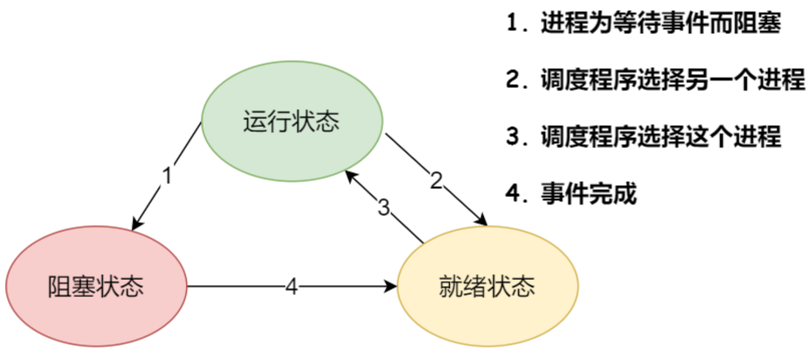
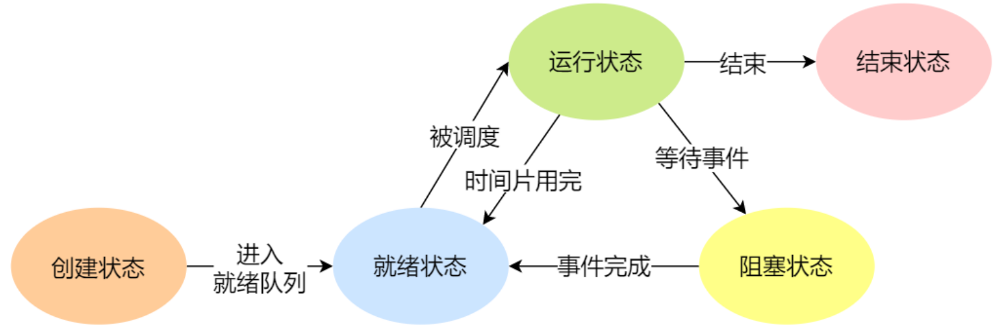
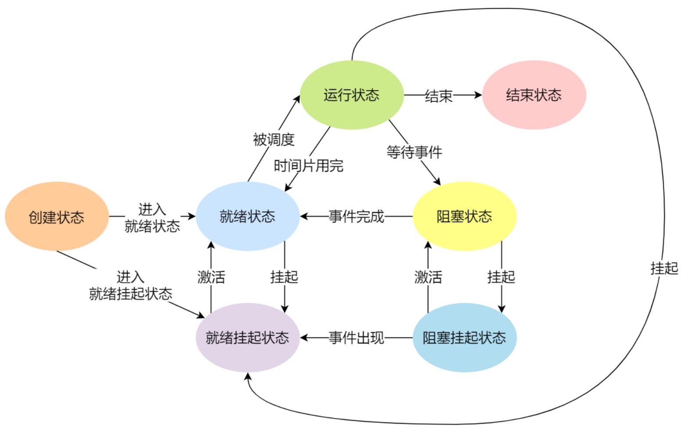

### 进程的状态转换

#### 三种状态
在一个进程的活动期间至少具备三种基本状态，运行状态、就绪状态、阻塞状态。



- 运行状态（ Running ）：该时刻进程占用 CPU ；
- 就绪状态（ Ready ）：可运行，由于其他进程处于运行状态而暂时停止运行；
- 阻塞状态（ Blocked ）：该进程正在等待某一事件发生（如等待输入/输出操作的完成）而暂时停止运行，这时，即使给它 CPU 控制权，它也无法运行。


#### 五种状态


进程还有另外两个基本状态：
- 新建状态（ New ）：进程正在被创建时的状态；
- 终止状态（ Terminated ）：进程结束或出现错误，或被系统终止，进入终止状态。无法再执行。

状态变迁说明：
- NULL → 新建状态：一个新进程被创建时的第一个状态；
- 新建状态 → 就绪状态：当进程被创建完成并初始化后，一切就绪准备运行时，进程已经准备好，已分配到所需资源，只要分配到 CPU 就能够立即运行；
- 就绪状态 → 运行状态：进程处于就绪状态被 CPU 调度后，进程进入执行状态；
- 运行状态 → 终止状态：当进程已经运行完成或出错时，进入终止状态，无法再执行；
- 运行状态 → 就绪状态：运行中的进程由于分配给它的时间片用完，变为就绪状态，从就绪状态中选中另外一个进程运行；
- 运行状态 → 阻塞状态：当进程请求某个事件且必须等待时，如请求 I/O 事件；
- 阻塞状态 → 就绪状态：当进程要等待的事件完成时，从阻塞状态变为就绪状态。

如果有大量阻塞状态的进程，会占用物理内存空间，造成浪费。所以在虚拟内存管理的操作系统中，通常会把阻塞状态的进程的物理内存空间换出到硬盘，等需要再次运行时，再从硬盘换入到物理内存。

所以需要新的状态，来**描述进程没有占用实际的物理内存空间的情况**，这个状态就是**挂起状态**。


#### 七种状态
挂起状态可以分为两种：
- 阻塞挂起状态：进程在硬盘并等待某个事件的出现；
- 就绪挂起状态：进程在硬盘，但只要进入内存便立刻运行。

这两种挂起状态加上前面的五种状态，就变成了七种状态变迁。



导致进程挂起的原因不只是因为进程所使用的内存空间不在物理内存，还包括以下情况：
- 通过 sleep 让进程间歇性挂起，其工作原理是设置一个定时器，到期后唤醒进程。
- 用户希望挂起一个程序的执行，如在 Linux 中用 ```Ctrl+Z``` 挂起进程。
