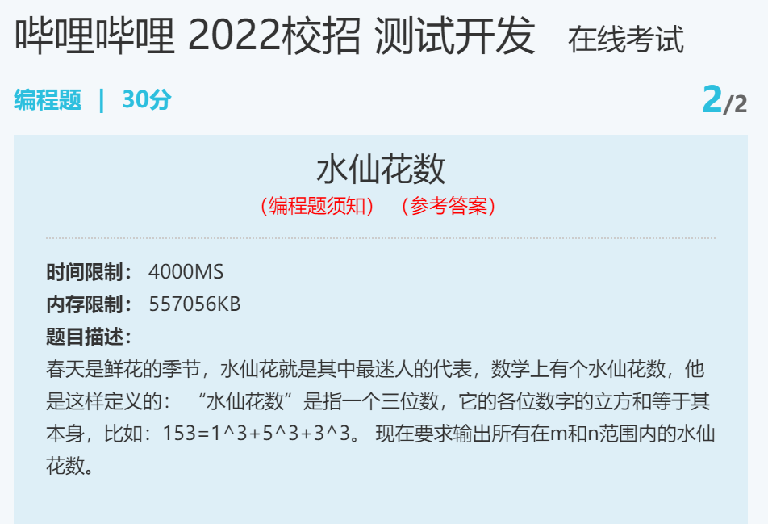

输入描述
> 输入数据有多组，每组占一行，包括两个整数m和n（100<=m<=n<=999）。

输出描述
> 对于每个测试实例，要求输出所有在给定范围内的水仙花数，就是说，输出的水仙花数必须大于等于m,并且小于等于n，如果有多个，则要求从小到大排列在一行内输出，之间用一个空格隔开; 如果给定的范围内不存在水仙花数，则输出no; 每个测试实例的输出占一行。


样例输入
> 100 120
300 380

样例输出
> no
370 371


Python3
```
while True:
    try:
        m, n = map(int, input().split())
        res = []
        for num in range(m, n+1):
            n1 = num % 10
            n10 = num // 10 % 10
            n100 = num // 100
            if num == n1 ** 3 + n10 ** 3 + n100 ** 3:
                res.append(num)
                print(num, end=' ')
        if len(res) == 0:
            print('no')
    except:
        break
```
