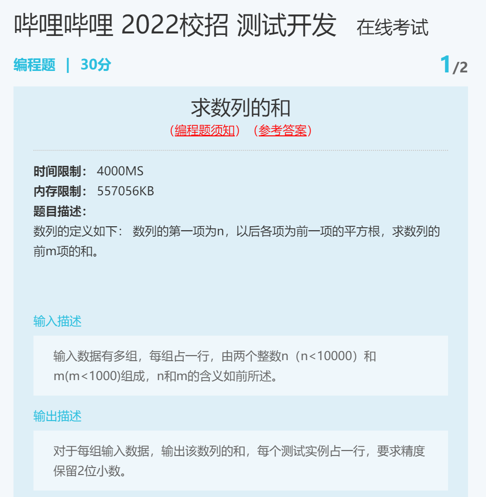

样例输入
> 81 4
2 2

样例输出
> 94.73
3.41

这个平台和 LeetCode 不一样！要自己写输入输出！

Python3 代码
```
while True:
    try:
        res = 0
        n, m = map(int, input().split())
        for _ in range(m):
            res += n
            n = n ** 0.5
        print("{:.2f}".format(res))
    except:
        break
```
